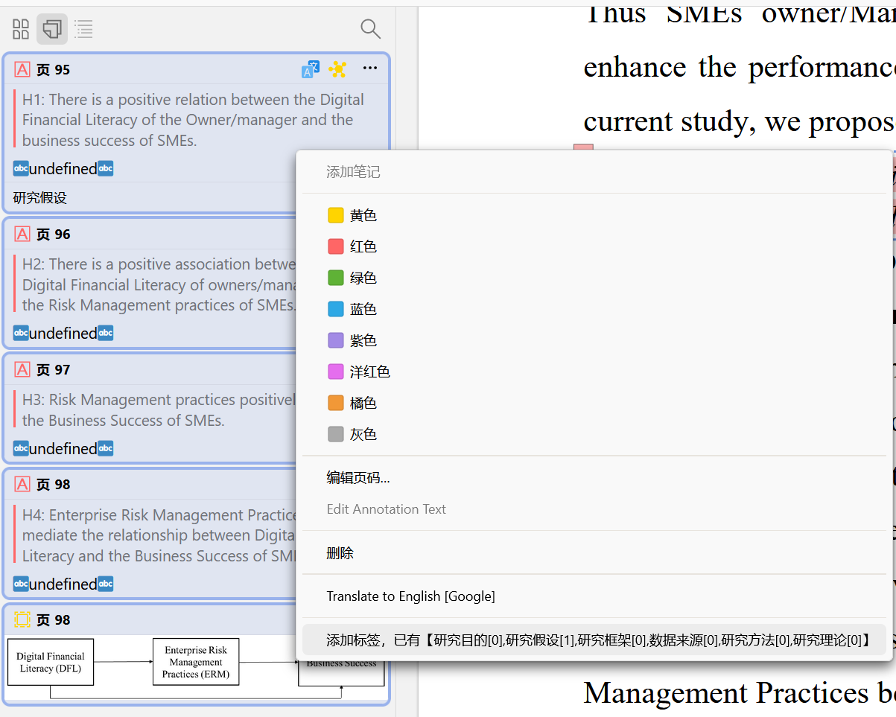
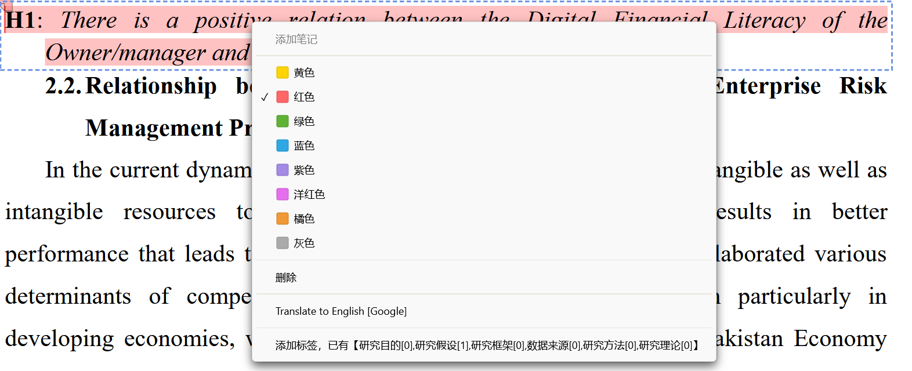
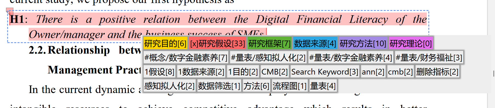
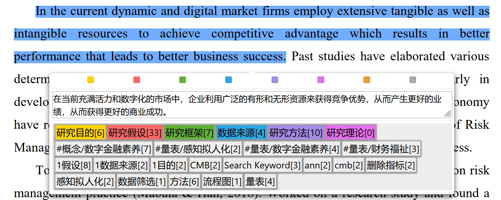
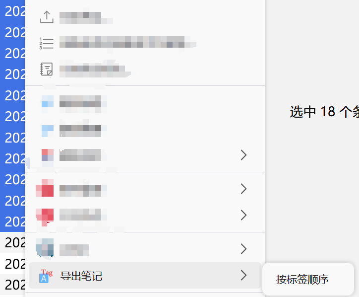

# Zotero的笔记整理

## 有趣的图标

😺❎✅❌🐉🦀🐓🦋🌸⭐🌟✨📍🆑🅰️🈷️⛔🚫❓
😺❎✅❌🐉🦀🐓🦋🌸⭐🌟✨📍🆑🅰️🈷️⛔🚫❓

## TODO

1、增加配置页面
2、增加更多的导出格式

## 注意

- 需要安装 @windingwind的[BetterNotes](https://github.com/windingwind/zotero-better-notes/releases/) 才能使用导出功能。
- 仅支持Zotero 7.0。

## 第一个功能 为注释添加标签

### 注释菜单1

### 注释菜单2

### 弹出框

### 选择文本

## 第二个功能 选中条目的右键菜单能够按tag导出笔记

是官方的【通过注释添加笔记】功能的补充

## 感谢

本插件基于@windingwind的[zotero-plugin-template](https://github.com/windingwind/zotero-plugin-template)开发，在此表示感谢。

感谢@windingwind 开发工具箱，[Zotero Plugin Toolkit](https://github.com/windingwind/zotero-plugin-toolkit)。

导出标签的灵感来自，[Ze-Notes](https://github.com/frianasoa/Ze-Notes)，非常好用的一个笔记整理方案

## Reminder

- This plugin required @windingwind's [BetterNotes](https://github.com/windingwind/zotero-better-notes/releases/)
- Only supports Zotero 7.0

## Disclaimer

This plugin based on @windingwind's [zotero-plugin-template](https://github.com/windingwind/zotero-plugin-template)，many thanks for his team's hard working。

We also acknowledge @windingwind's [Zotero Plugin Toolkit](https://github.com/windingwind/zotero-plugin-toolkit)。

## License

Use this code under AGPL. No warranties are provided. Keep the laws of your locality in mind!
