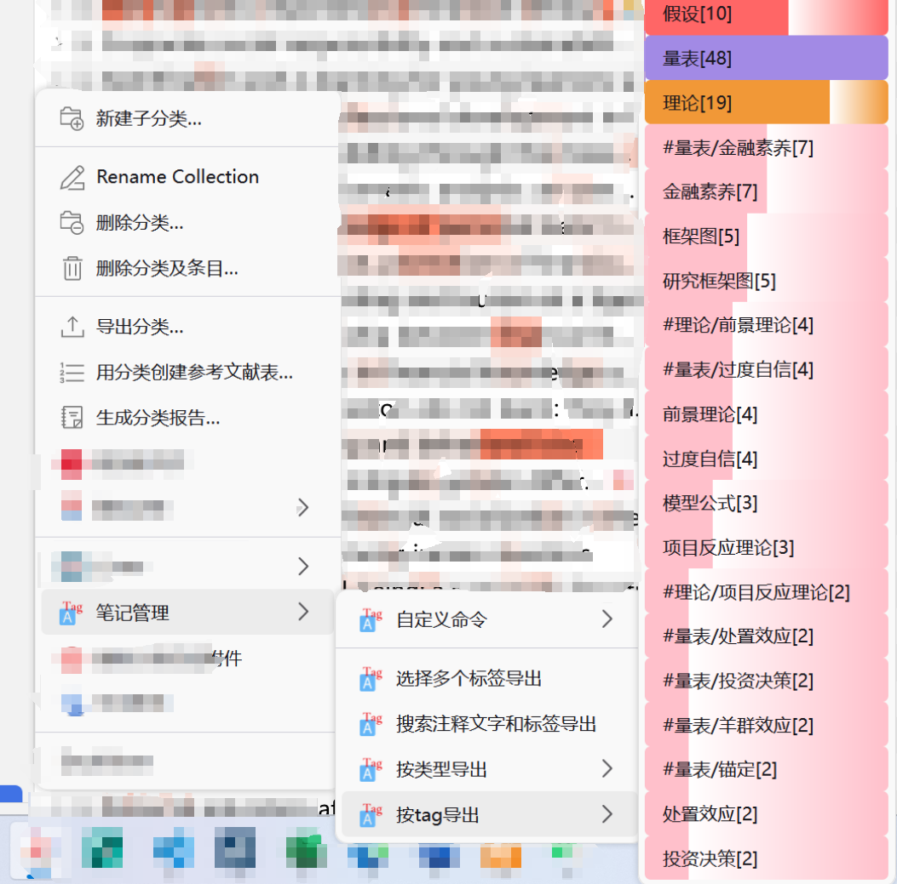
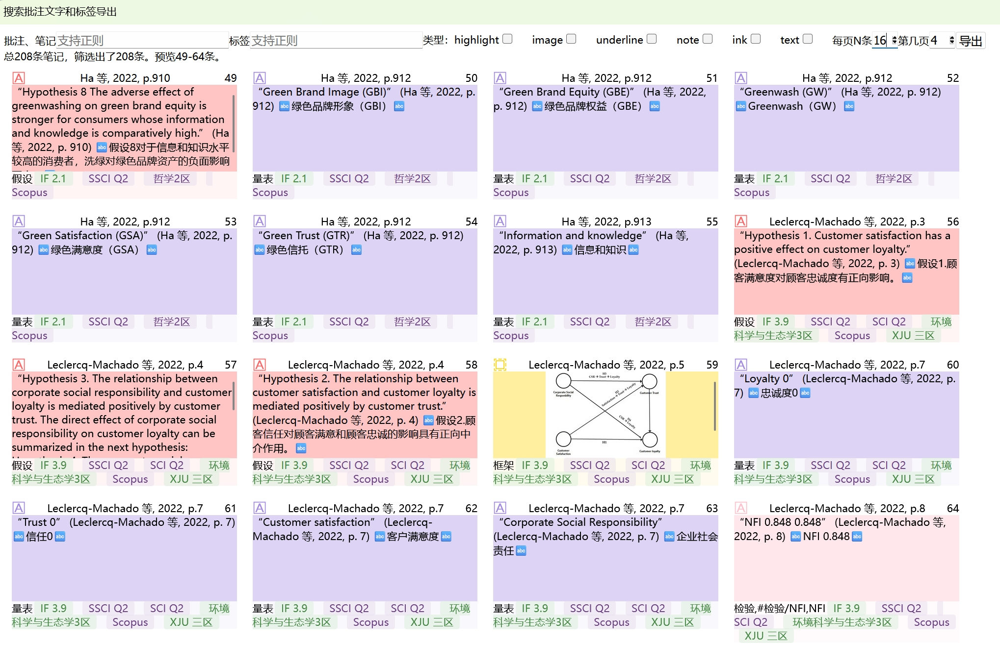
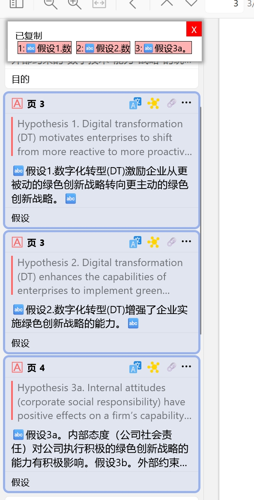
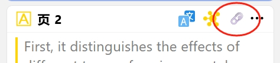
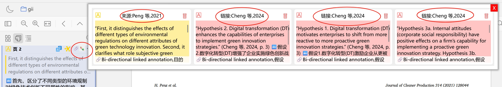
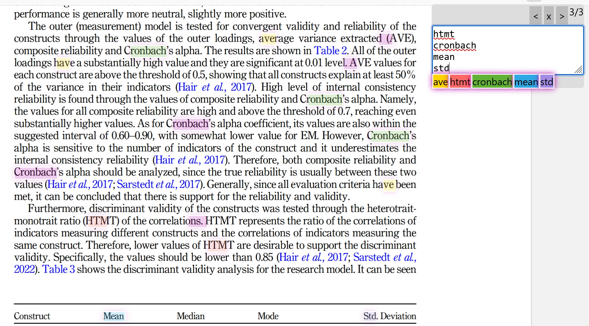
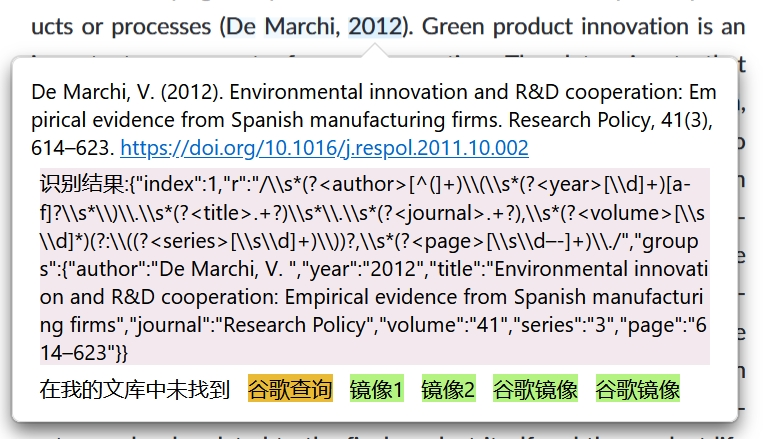

# Zotero的笔记整理

[](https://www.zotero.org)
[](https://github.com/windingwind/zotero-plugin-template)

一个tag管理工具，方便自己管理annotation和tag，进行各种汇总统计，让笔记不白做。

希望能够实现自己关于笔记整理的想法

## 有趣的图标

😺❎✅❌🐉🦀🐓🦋🌸⭐🌟✨📍🅰️⛔🚫❓

## TODO

- 增加分割标签的功能[已完成]
- 增加按搜索批注和标签导出的功能[已完成]
- ...

## 注意

- 需要安装 [@windingwind](https://github.com/windingwind)的[BetterNotes](https://github.com/windingwind/zotero-better-notes/releases/) 才能使用导出功能。
- 仅支持Zotero 7.0。

## 功能介绍

- 添加批注
- 导出批注为笔记
- 一些自用的功能
- 增加颜色功能，这个功能可以说是我最开始做这个插件的初衷，想让颜色能够分门别类。没想到做来做去变成了一个这么复杂的插件

### 第一个功能 添加批注

分为了两种。一种是选择文字弹出笔记，还有一种是在已有笔记中添加标签
在弹出的颜色框里面显示文字。感谢zotero-style作者提供的标注颜色修改功能，让标注颜色更丰富

#### 批注菜单1


#### 批注菜单2


#### 弹出框


#### 选择文本


### 第二个功能 导出批注为笔记

我觉得笔记就是用来复习自己看的文章的，这个功能是官方的【通过批注添加笔记】功能的补充

#### 陆续会增加不同格式的导出






### 第三个功能 批注双链

目前想到的场景是，文献来源可以标记了，后期会出一个批注链接的导出功能。显示当前批注链接到了哪个文献，特别是写综述的时候有用。

#### 操作

第一步、在要添加双链的地方添加批注, 然后选中这个批注, 按下Ctrl+c按键复制这个批注到剪切板。也可以选择多个已经做好的批注。这样就把链接的目标批注设置好了。 

第二步、在要关联双链的添加批注, 然后选中这个批注, 点击添加关联。这样就设置好了这些批注的关联关系。


完成以上2个步骤, 就表示链接完成, 可以幸福的使用双链浏览功能了。

双链浏览功能能在不同的pdf之间跳转，我觉得非常有用。于是就实现了它。


### 第四个功能 高亮显示特定单词(老是卡顿，性能优化中)

使用的是html的定位和查找，所以有定位错误和漏掉的单词。

有的时候想让特定单词进行高亮显示，能一眼找到，那么你就需要这个功能。**为了性能，只渲染最近三个屏幕**

点T，把需要的单词放里面。滚动鼠标渲染上下页。

可以使用正则，忽略大小写
示例：t.{3}

因为是页面查找所以无法克服fi被识别为fi问题。



### 第五个功能 添加链接的搜索按钮

添加搜索按钮纯粹为了我自己的方便



配置镜像站点

因为镜像站点经常换，所以做成了配置的方式


### 建议的固定标签配置

根据个人习惯配置固定在前面的标签。我为你准备了这么多，你看够不够用？
评ps:另外颜色要用小写，不然可能会报错颜色错误。感谢 [@Geo123abc] 提的想法

```
目的, #ffd400,  假设, #ff6666,  框架, #5fb236,  数据, #2ea8e5量表, #a28ae5, 方法, #e56eee, 理论, #f19837, 结论, #aaaaaa, 贡献, #69af15, 未来, #ba898e, 背景, #ee8574, 现状, #6a99e7, 问题, #e65fa1, 对策, #62e0ef
```

## 感谢

本插件基于[@windingwind](https://github.com/windingwind)的[zotero-plugin-template](https://github.com/windingwind/zotero-plugin-template)开发，在此表示感谢。

感谢[@windingwind](https://github.com/windingwind)开发工具箱，[Zotero Plugin Toolkit](https://github.com/windingwind/zotero-plugin-toolkit)。

导出标签的灵感来自 ，[Ze-Notes](https://github.com/frianasoa/Ze-Notes)，非常好用的一个笔记整理方案。

Nested Tags 的灵感来自 [Zotero-Style](https://github.com/MuiseDestiny/zotero-style)，一直在用这个插件。Nested Tags 相关的内容仅仅为自己方便添加标签而设计。

批注双链灵感来自 [@YaoLiMuMu](https://github.com/windingwind/zotero-actions-tags/discussions/296)，非常好的批注链接方案。同时感谢 [@Geo123abc](https://github.com/Geo123abc) 提供的双链代码。目前采用dc:relation建立双链，和条目的链接信息是一样的。目前做的只能链接到批注，未来可能做到和条目链接。

感谢zotero-style作者提供的标注颜色修改功能，让标注颜色更丰富。我做这个插件的时候就是希望能够改进颜色和标注类型的关系，看到zotero-style能够改颜色真的觉得太棒了。我想让通过颜色能够分门别类加批注，于是做了固定标签，后来增加输入标签，没想到做来做去变成了一个这么复杂的插件

## Reminder

- This plugin required @windingwind's [BetterNotes](https://github.com/windingwind/zotero-better-notes/releases/)
- Only supports Zotero 7.0

## Disclaimer

This plugin based on @windingwind's [zotero-plugin-template](https://github.com/windingwind/zotero-plugin-template)，many thanks for his team's hard working。

We also acknowledge @windingwind's [Zotero Plugin Toolkit](https://github.com/windingwind/zotero-plugin-toolkit)。

## License

Use this code under AGPL. No warranties are provided. Keep the laws of your locality in mind!
